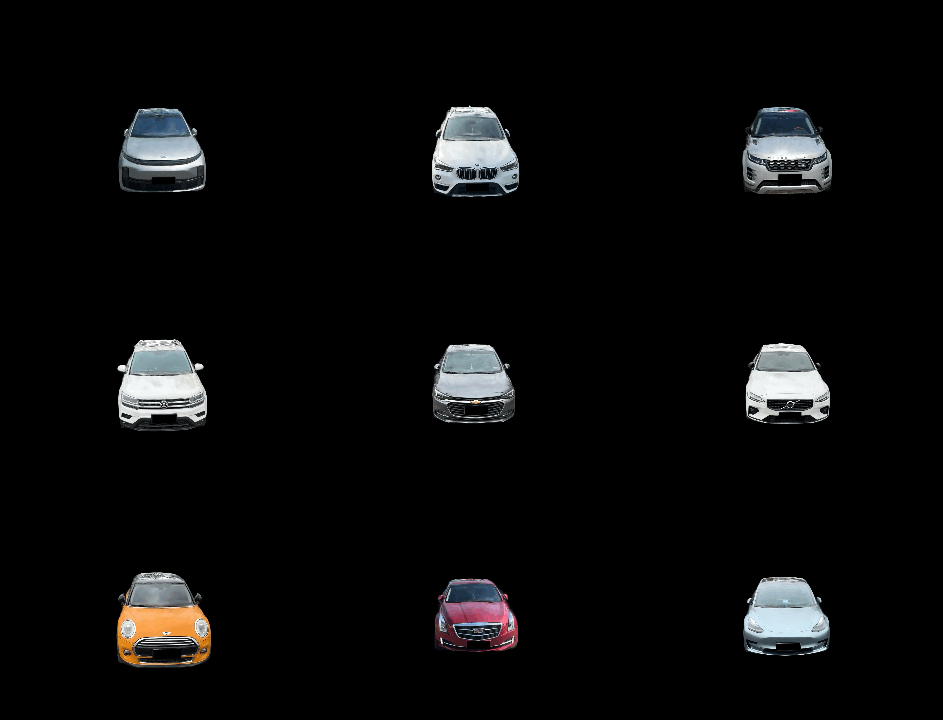
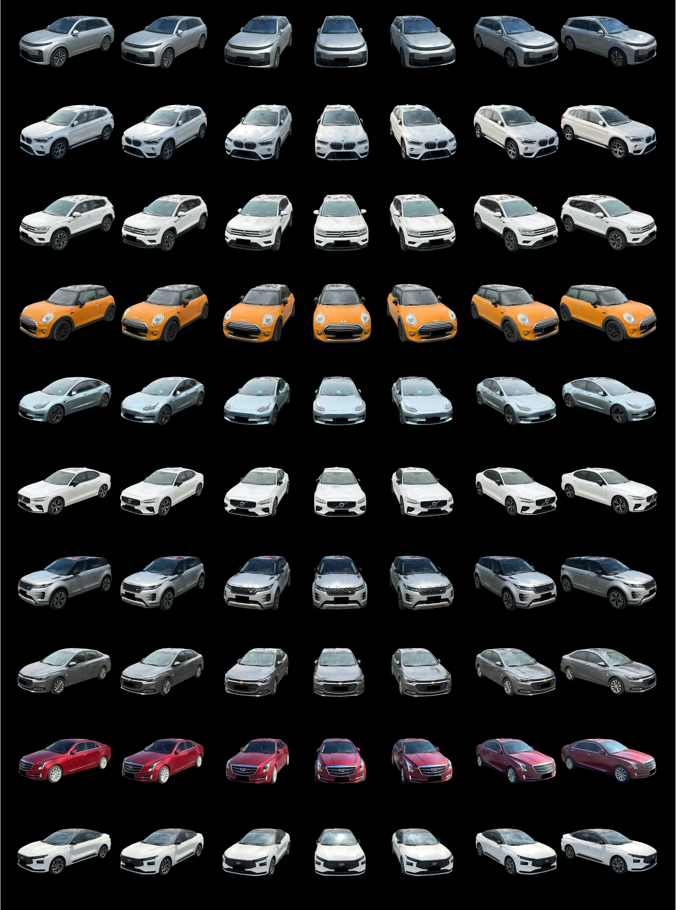

> Re-direct to the full [**PAPER**](https://openaccess.thecvf.com/content/ICCV2025/html/Du_3DRealCar_An_In-the-wild_RGB-D_Car_Dataset_with_360-degree_Views_ICCV_2025_paper.html) and [**CODE**](https://github.com/xiaobiaodu/3DRealCar_Toolkit)

3D cars are widely used in self-driving systems, virtual and augmented reality, and gaming applications. However, existing 3D car datasets are either synthetic or low-quality, limiting their practical utility and leaving a significant gap with the high-quality real-world 3D car dataset. In this paper, we present the first large-scale 3D real car dataset, termed 3DRealCar, which offers three key features: (1) High-Volume: 2,500 cars meticulously scanned using smartphones to capture RGB images and point clouds with real-world dimensions; (2) High-Quality: Each car is represented by an average of 200 dense, high-resolution 360-degree RGB-D views, enabling high-fidelity 3D reconstruction; (3) High-Diversity: The dataset encompasses a diverse collection of cars from over 100 brands, captured under three distinct lighting conditions (reflective, standard, and dark). We further provide detailed car parsing maps for each instance to facilitate research in automotive segmentation tasks. To focus on vehicles, background point clouds are removed, and all cars are aligned to a unified coordinate system, enabling controlled reconstruction and rendering. We benchmark state-of-the-art 3D reconstruction methods across different lighting conditions using 3DRealCar. Extensive experiments demonstrate that the standard lighting subset can be used to reconstruct high-quality 3D car models that significantly enhance performance on various car-related 2D and 3D tasks. Notably, our dataset reveals critical challenges faced by current 3D reconstruction methods under reflective and dark lighting conditions, providing valuable insights for future research.

# Qualitatives
## Reconstruction in 3D Gaussian Splatting

More examples


# Cite 

If you find this work useful in your research, please cite:

```bash
@InProceedings{Du_2025_ICCV,
    author    = {Du, Xiaobiao and Wang, Yida and Sun, Haiyang and Wu, Zhuojie and Sheng, Hongwei and Wang, Shuyun and Ying, Jiaying and Lu, Ming and Zhu, Tianqing and Zhan, Kun and Yu, Xin},
    title     = {3DRealCar: An In-the-wild RGB-D Car Dataset with 360-degree Views},
    booktitle = {Proceedings of the IEEE/CVF International Conference on Computer Vision (ICCV)},
    month     = {October},
    year      = {2025},
    pages     = {26488-26498}
}
```

