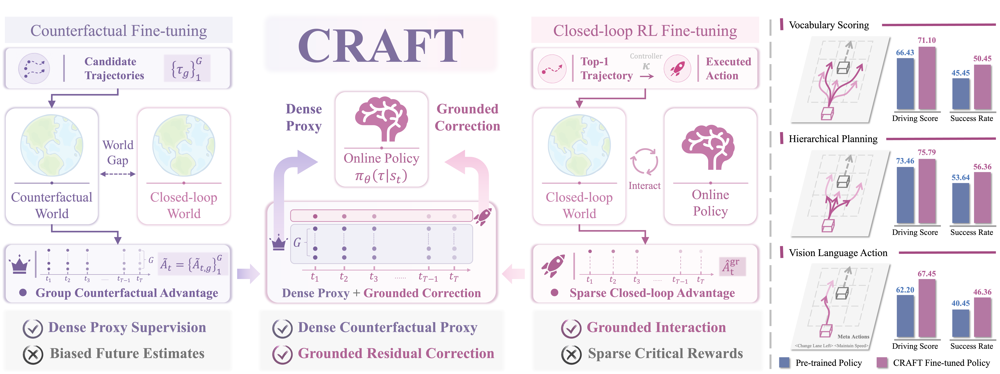

> Re-direct to the full [**PAPER**](https://arxiv.org/abs/2605.04470) and [**PROJECT PAGE**](https://currychen77.github.io/CRAFT/)

CRAFT is a reinforcement fine-tuning framework for autonomous driving policies that combines dense counterfactual supervision with grounded closed-loop residual feedback. It treats counterfactual trajectory scoring as a broad proxy signal, then uses executed on-policy rollouts to correct interaction-dependent failures, while an EMA teacher preserves reliable pre-trained behavior during adaptation. Across multiple driving-policy families, this design improves driving score and success rate in closed-loop Bench2Drive evaluation.

# Methodology
## Framework Overview



CRAFT combines trajectory-level counterfactual supervision, closed-loop residual feedback, and asymmetric KL self-distillation, giving a stable and scalable fine-tuning recipe for driving policies.

# Qualitatives

<video autoplay controls loop muted playsinline style="width: 100%; height: auto; border-radius: 4px;">
    <source src="images/demo.mp4" type="video/mp4">
</video>


# Cite

If you find this work useful in your research, please cite:

```bash
@misc{chen2026craft,
  title={CRAFT: Counterfactual-to-Interactive Reinforcement Fine-Tuning for Driving Policies},
  author={Keyu Chen and Nanfei Ye and Yida Wang and Wenchao Sun and Danqi Zhao and Hao Cheng and Sifa Zheng},
  year={2026},
  eprint={2605.04470},
  archivePrefix={arXiv},
  primaryClass={cs.LG},
  url={https://arxiv.org/abs/2605.04470}
}
```