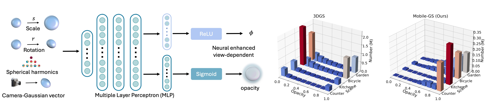

> Re-direct to the full [**PAPER**](https://arxiv.org/abs/2603.11531) and [**CODE**](https://github.com/xiaobiaodu/mobile-gs)

<video autoplay controls loop muted playsinline style="width: 100%; height: auto; border-radius: 4px;">
    <source src="images/teaser.mp4" type="video/mp4">
</video>

# Abstract

3D Gaussian Splatting (3DGS) has emerged as a powerful representation for high-quality rendering across a wide range of applications. However, its high computational demands and large storage costs pose significant challenges for deployment on mobile devices. In this work, we propose a mobile-tailored real-time Gaussian Splatting method, dubbed Mobile-GS, enabling efficient inference of Gaussian Splatting on edge devices. Specifically, we first identify alpha blending as the primary computational bottleneck, since it relies on the time-consuming Gaussian depth sorting process. To solve this issue, we propose a depth-aware order-independent rendering scheme that eliminates the need for sorting, thereby substantially accelerating rendering. Although this order-independent rendering improves rendering speed, it may introduce transparency artifacts in regions with overlapping geometry due to the scarcity of rendering order. To address this problem, we propose a neural view-dependent enhancement strategy, enabling more accurate modeling of view-dependent effects conditioned on viewing direction, 3D Gaussian geometry, and appearance attributes. In this way, Mobile-GS can achieve both high-quality and real-time rendering. Furthermore, to facilitate deployment on memory-constrained mobile platforms, we introduce first-degree spherical harmonics distillation, a neural vector quantization technique, and a contribution-based pruning strategy to reduce the number of Gaussian primitives and compress the 3D Gaussian representation with the assistance of neural networks. Extensive experiments demonstrate that our proposed Mobile-GS achieves real-time rendering and compact model size while preserving high visual quality, making it well-suited for mobile applications.

# Methodology
## Motivation
We found sorting as the primary performance bottleneck. Runtime analysis of the original 3DGS highlights that the sorting operation incurs a significant computational overhead during inference. Removing the sorting step substantially accelerates 3DGS, achieving several-fold speedup compared to the original implementation.

## Rendering Pipeline
In the inference stage, different from 3DGS, our proposed method eliminates the tile-based rendering and the 3D Gaussian sorting process typically required for accurate alpha blending. Instead, we render all 3D Gaussians associated with a target pixel in a single pass. To further improve performance and maintain visual quality, we propose a depth-aware order-independent rendering strategy that replaces the original sorting-dependent alpha blending.

## High-valued Opacity


Left: We leverage an MLP fed with 3D Gaussian scale, rotation, spherical harmonics, and the vector of the camera toward the 3D Gaussian as input to predict a view-dependent opacity. Right: We display that our Mobile-GS removes redundant opacity and keeps important Gaussians with high opacity.

## Runtime Analysis
Detailed runtime analysis of our proposed Mobile-GS evaluated on four representative scenes, covering both indoor and outdoor environments from the Mip-NeRF 360 dataset. Despite the inclusion of MLPs, which are often regarded as computationally demanding, our design introduces minimal overhead, ensuring real-time performance without compromising visual fidelity.

# Qualitatives
## Compare with 3DGS

<video controls loop muted playsinline style="width: 100%; height: auto; border-radius: 4px;">
    <source src="images/room.mp4" type="video/mp4">
</video>

> For more comparison videos on additional scenes (bicycle, garden, kitchen), visit the [**Mobile-GS project page**](https://xiaobiaodu.github.io/mobile-gs-project/).

# Cite

If you find this work useful in your research, please cite:

```bash
@inproceedings{du2026mobilegs,
    title={Mobile-GS: Real-time Gaussian Splatting for Mobile Devices},
    author={Xiaobiao Du and Yida Wang and Kun Zhan and Xin Yu},
    booktitle={International Conference on Learning Representations (ICLR)},
    year={2026}
}
```
