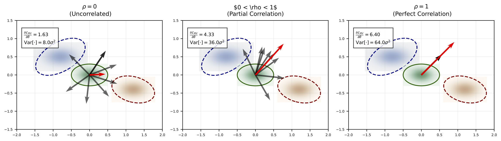
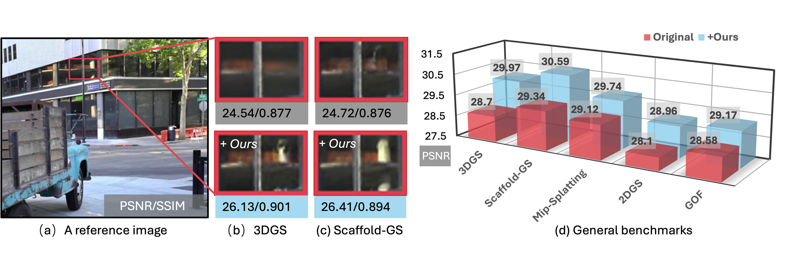

> Re-direct to the full [**PAPER**](https://arxiv.org/pdf/2410.02103), [**PROJECT PAGE**](https://xiaobiaodu.github.io/mvgs/), and [**CODE**](https://github.com/xiaobiaodu/mvgs)





# Abstract

Recent works in novel view synthesis, \textit{e.g.}, Neural Radiance Field (NeRF) and 3D Gaussian Splatting (3DGS), have significantly advanced rendering quality and efficiency. However, existing Gaussian-based novel view synthesis methods typically follow a single-view optimization paradigm. We observed that this optimization paradigm suffers from unstable gradients, leading to suboptimal rendering quality. To tackle this issue, we present a novel multi-view regulated Gaussian Splatting (MVGS) that fully leverages a multi-view coherent (MVC) constraint throughout the optimization process. Specifically, our proposed MVC enhances 3D Gaussian multi-view consistency and thus ensures smoother gradient updates. Furthermore, since single-scale training usually leads to suboptimal solutions, we propose a cross-intrinsic guidance scheme in a coarse-to-fine manner to further improve the convergence of multi-view optimization in 3DGS. In particular, by incorporating more multi-view images at the low resolution, we can optimize 3D Gaussians with a more comprehensive perspective. Then, finer-scale Gaussians are initialized by coarsely estimated ones instead of optimizing full-scale 3D Gaussians from scratch. Moreover, we found that 3D Gaussians usually struggle to fit 2D training views with minimal overlap. Thus, we propose a novel multi-view cross-ray densification strategy, where 3D Gaussians are dynamically split to accommodate drastic viewpoint variations in the multi-view optimization process. In this way, the multi-view consistency can be further improved. Notably, our proposed MVGS method is a plug-and-play optimizer. Extensive experiments across various tasks demonstrate that our proposed MVGS improves existing Gaussian-based methods and achieves state-of-the-art performance.

# Cite

If you find this work useful in your research, please cite:

```bash
@misc{du2026mvgsmultiviewregulatedgaussian,
      title={MVGS: Multi-view Regulated Gaussian Splatting for Novel View Synthesis},
      author={Xiaobiao Du and Yida Wang and Xin Yu},
      year={2026},
      eprint={2410.02103},
      archivePrefix={arXiv},
      primaryClass={cs.CV},
      url={https://arxiv.org/abs/2410.02103},
}
```