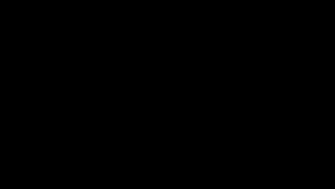

> Re-direct to the [**CODE**](https://github.com/wangyida/neural-actor)



A library for rendering neural actors, and benchmarking dynamic NeRF

<table style="width: 100%; border: none; border-collapse: collapse;">
  <tr style="border: none;">
    <td style="width: 50%; padding: 5px; border: none;">
      
    </td>
    <td style="width: 50%; padding: 5px; border: none;">
      
    </td>
  </tr>
</table>

# Cite 

If you find this work useful in your research, please cite:

```bash
@misc{rama2023wang,
Author = {Yida Wang},
Year = {2023},
Note = {https://github.com/wangyida/neural-actor},
Title = {Rendering, Animating and Meshing Actors with NeRF}
}
```

