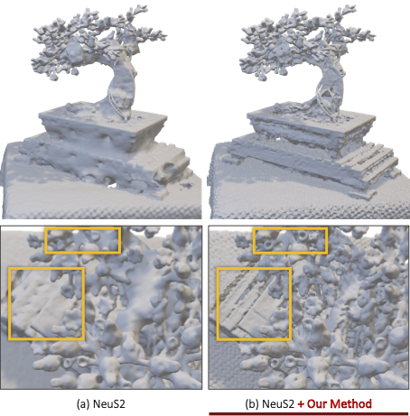

> Re-direct to the full [**PAPER**](https://arxiv.org/pdf/2406.09801?) and [**CODE**](https://github.com/wangyida/ra-neus)

Our objective is to leverage a differentiable radiance field *e.g.* NeRF to reconstruct detailed 3D surfaces in addition to producing the standard novel view renderings.
RaNeuS adaptively adjusts the regularization on the signed distance field so that unsatisfying rendering rays won't enforce strong Eikonal regularization which is ineffective, and allow the gradients from regions with well-learned radiance to effectively back-propagated to the SDF.  Consequently, balancing the two objectives in order to generate accurate and detailed surfaces.

# Applications


<!-- Row 1: Image Left, Text Right -->
<div style="display: flex; gap: 20px; align-items: flex-start; margin-bottom: 30px;">
    <div style="flex: 1; width: 50%;">
        
    </div>
    <div style="flex: 1; width: 50%;">
        <h3 style="margin-top: 0;">Urban area reconstruction</h3>
        <p>Given a set of images shot by cameras mounted on drones, an urban area is represented by the mesh extracted by marching cube from a leared signed distance field (SDF) which is optimized by <a href="https://github.com/wangyida/ra-neus"><strong>RaNeuS</strong></a>.</p>
    </div>
</div>

<!-- Row 2: Text Left, Image Right -->
<div style="display: flex; gap: 20px; align-items: flex-start; margin-bottom: 30px;">
    <div style="flex: 1; width: 50%;">
        <h3 style="margin-top: 0;">Advantages against NeuS</h3>
        <p>Comparison of our mesh to Neus 2, focusing on some important details on the bonsai dataset that our method was able to reconstruct while NeuS 2 missed.</p>
    </div>
    <div style="flex: 1; width: 50%;">
        
    </div>
</div>


Geometric reconstruction comparison evaluated on the Mip-NeRF 360 dataset

# Cite 

If you find this work useful in your research, please cite:

```bash
@inproceedings{wang2024raneus,
  title={Raneus: Ray-adaptive neural surface reconstruction},
  author={Wang, Yida and Tan, David Joseph and Navab, Nassir and Tombari, Federico},
  booktitle={2024 International Conference on 3D Vision (3DV)},
  pages={53--63},
  year={2024},
  organization={IEEE}
}
```

