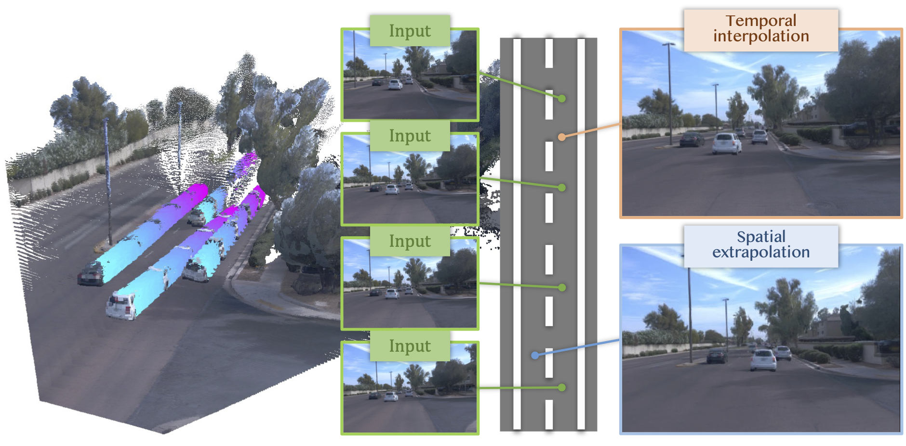

> Re-direct to the full [**PAPER**](https://arxiv.org/abs/2603.19552) and [**PROJECT PAGE**](https://streetforward.github.io/)

We present StreetForward, a pose-free and tracker-free feedforward framework for dynamic street reconstruction. Building upon alternating attention, it introduces a temporal mask attention module that captures dynamic motion from image sequences and produces motion-aware latent representations. Static content and dynamic instances are represented uniformly with 3D Gaussian Splatting and optimized jointly through cross-frame rendering with spatio-temporal consistency, enabling high-fidelity novel-view synthesis at new poses and times while also estimating per-pixel velocities.

# Methodology
## Pipeline



The input video is encoded into per-frame patch features and processed by alternating global and frame attention to aggregate temporal information. A causal masked attention module then forms motion-aware features that estimate motion and dynamic masks, and the final 4D scene is obtained by combining static Gaussians with propagated dynamic Gaussians.

# Qualitative Comparison

## Spatial Extrapolation

<video controls loop muted playsinline style="width: 100%; height: auto; border-radius: 4px;">
    <source src="https://streetforward.github.io/static/videos/scene0.mp4" type="video/mp4">
</video>

## Temporal Interpolation

<video controls loop muted playsinline style="width: 100%; height: auto; border-radius: 4px; margin-bottom: 16px;">
    <source src="https://streetforward.github.io/static/videos/scene1.mp4" type="video/mp4">
</video>

<video controls loop muted playsinline style="width: 100%; height: auto; border-radius: 4px; margin-bottom: 16px;">
    <source src="https://streetforward.github.io/static/videos/scene2.mp4" type="video/mp4">
</video>

<video controls loop muted playsinline style="width: 100%; height: auto; border-radius: 4px;">
    <source src="https://streetforward.github.io/static/videos/scene3.mp4" type="video/mp4">
</video>

## More Results

<video controls loop muted playsinline style="width: 100%; height: auto; border-radius: 4px;">
    <source src="https://streetforward.github.io/static/videos/more_datasets.mp4" type="video/mp4">
</video>

## Real application For mountain areas

A real application example for mountain areas.

<video controls loop muted playsinline style="width: 100%; height: auto; border-radius: 4px;">
    <source src="images/sheepherder.mp4" type="video/mp4">
</video>

<p><a href="images/sheepherder.mp4" download>Download MP4</a></p>

# Cite

If you find this work useful in your research, please cite:

```bash
@article{yu2026streetforward,
  title={StreetForward: Perceiving Dynamic Street with Feedforward Causal Attention},
  author={Yu, Zhongrui and Wang, Zhao and Xie, Yijia and Wang, Yida and Zhang, Xueyang and Zhan, Yifei and Zhan, Kun},
  journal={arXiv preprint arXiv:2603.19552},
  year={2026}
}
```